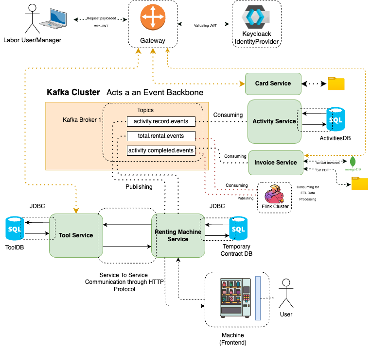
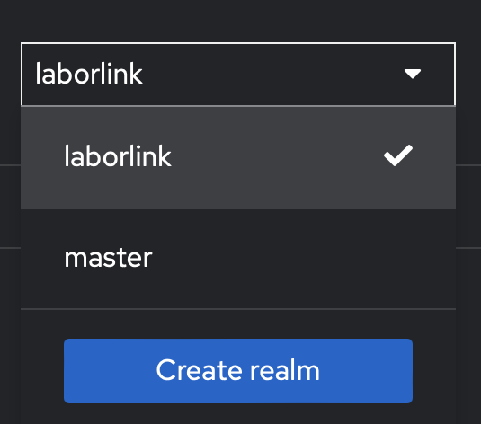
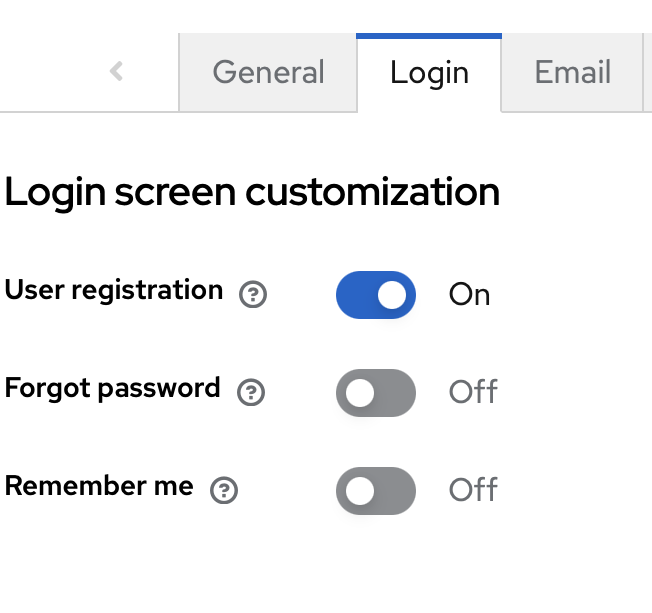
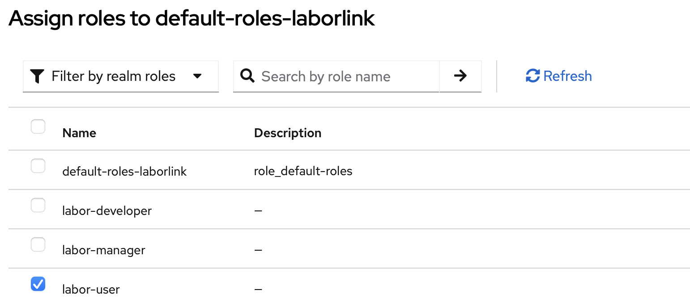
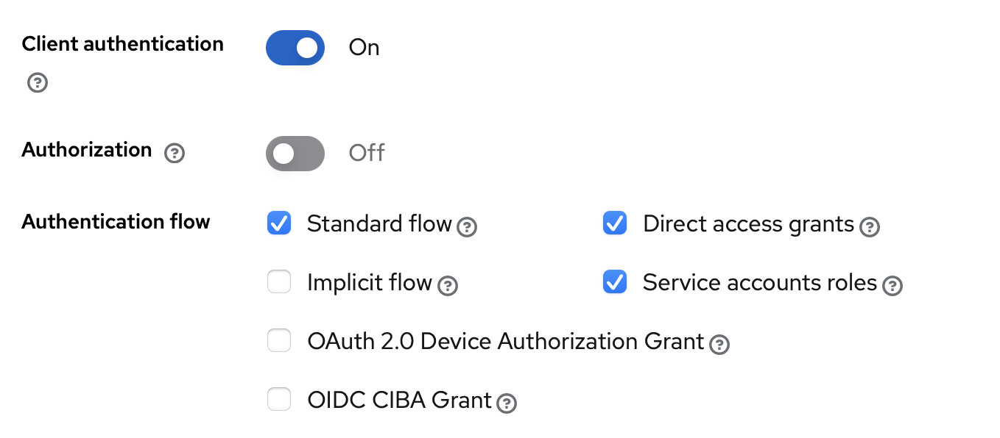
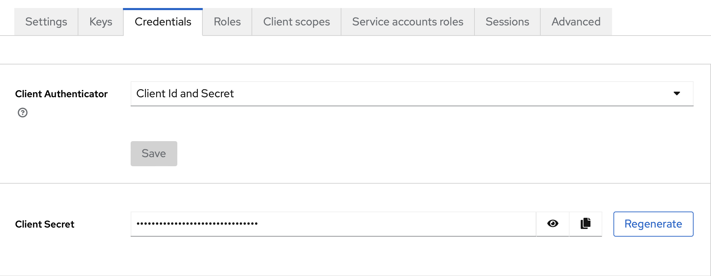
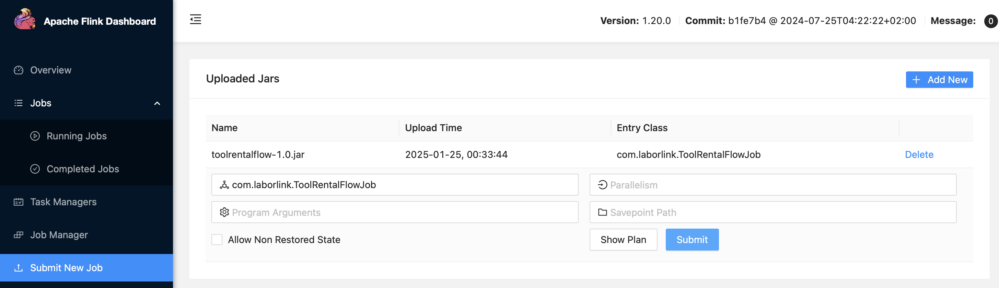
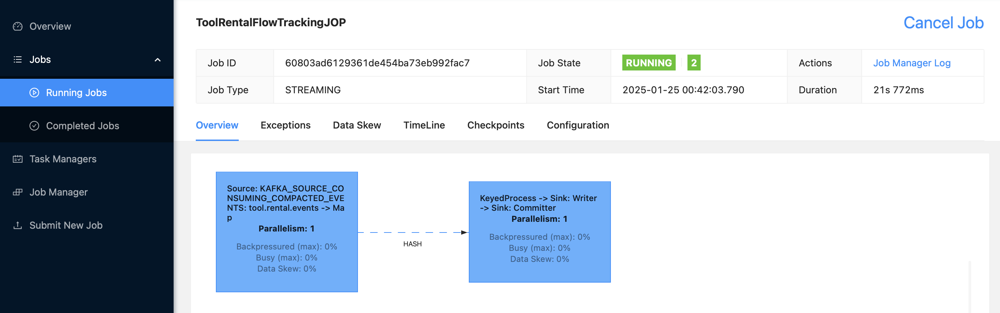

#  Laborlink 

## Overview

### [1] Project Description
LaborLink is a fully integratable enterprise system designed for renting labor tools to researchers, students, and hobbyists. It includes a powerful pipeline that effectively tracks customer activities, detects fraudulent behavior, and provides invoices to end customers. The system leverages modern technologies for communication and data processing and is built with future horizontal scaling in mind. Additionally, it supports integration with external third parties (e.g., delivery of labor cards or collaboration with other LaborLink provider companies).

### [1.1] Architecture: Event-Driven Design with Kafka as an Events Backbone

<div style="display: flex; justify-content: center; width: 100%;">
    
</div>

### [1.2] Enviroment & Services

Backend is generally based on Java and Python.

//------- *Developments Tools* ----------------

📦 Apache Maven 3.9.9

📦 Python => 3.12 & (3.13.1) Recommended

📦 JDK 17.0.13 2024-10-15 LTS

//------- *Databases* ----------------

📈 MariaDB 11.6.2

📈 MongoDB mongodb-community@6.0

//------- *External Servers* ----------------

👔 Apache Kafka 3.6.0 - Scala 2.13 (Communication Backbone)

👔 Apache Flink 1.20.0 Scala 2.12 (ETL Stream Data Processing)

👔 Keycloak 26.1.0 (Open Identity Provider)

//------- *Ports & UI* ----------------

✨ Keycloak --PORT:8080, UI: http://localhost:8080

✨ Gateway --PORT:8087, UI:NONE, *However we provided a POSTMAN-COLLECTION for testing*

✨ Kafka --PORT:9092, UI:NONE

✨ Flink --PORT:8081, UI: http://localhost:8081/

✨ Tool Service --PORT:8082, UI:, *However we provided a POSTMAN-COLLECTION for testing*

✨ Renting Machine Service --PORT:8084, *However we provided a POSTMAN-COLLECTION for testing*

✨ Activity Service --PORT:8083,UI:, *However we provided a POSTMAN-COLLECTION for testing*

✨ Invoice Service --PORT:8085,UI:, *However we provided a POSTMAN-COLLECTION for testing*

✨ Labor User/Manager Dashboard --PORT:3000; http://localhost:3000/

✨ Labor Renting Machine Monitor --PORT:3000; http://localhost:3001/


## [2] Lunching Laborlink 

### [2.1] Cloning Service and Submodules

*Cloning Labor Link*

```bash
# To Clone Project please execute 
git clone https://gitlab.w-hs.de/DevDynasty/eai/laborlink.git
```

*Initialize Submodules: Please make sure you are under LaborLink dir*

```bash
# To Initialize the Submodules please run
git submodule update --init --recursive --remote
```

### [2.2] Install External Servers

👔 (108Mb) Apache Kafka 3.6.0 scala 2.13 *Install & Extract under path backend/kafka*

👔 (461 Mb) Apache Flink 1.20.0 scala 2.12 *Install & Extract under path backend/flink*

👔 (141 Mb) Keycloak 26.1.0 *Install & Extract under path backend/flink*

**Automated Installation:** We have configured a makefile to collect all required resources with the versions we have used as will as cleaning installation files. To install all automatically please run:

```bash
# To Install all and remove installation files
make install-servers
```

**Or Manuall Installation:** please make sure that kafka existed under path backend/kafka to execute other commands later to create topics

```bash
# Install Apache Kafka
curl -o kafka.tgz https://archive.apache.org/dist/kafka/3.6.0/kafka_2.13-3.6.0.tgz

# Install Apache Flink
curl -o flink.tgz https://dlcdn.apache.org/flink/flink-1.20.0/flink-1.20.0-bin-scala_2.12.tgz

# Install Apache Keycloak
curl -L -o keycloak.zip https://github.com/keycloak/keycloak/releases/download/26.1.0/keycloak-26.1.0.zip
```


### [2.3] Install Databases
📈 MariaDB (212.3MB)
📈 mongodb/brew/mongodb-community@6.0 (202.4MB)

```bash
# Easiest way through homebrew 
brew install mariadb
brew tap mongodb/brew
brew install mongodb-community
```


### [2.4] Confirue KeyCloack IdentityProvider
Keycloak is a centralized identity and access management system. it's responsible of Authentication and managing roles for users. With keycloak we hv also the ability to integrate other third-part Organization (eg Other Laborlink-Service-Providers, Delivars Services etc) and Keycloak can handle and manage roles in perfect way.

We have right know three Roles *Labor-User*,*Labor-Manager* and *Labor-Developer(optional)*.

*Note* Now we are going to configure keycloak with Confendential Client.
*Note* Laborlink frontend Support Server Side Rendering and the secret key will be stored in the server side.

*Note* OAuth2 Flow
  -- UI detect if the user logged in or not if not then the user will be redirect to keycloack Auth Url.
  -- After login the user will be redirected again with Authorization Code to callback url in frontside for token exchange in Nuxt Server Side
  -- After Token exchange the Acess & Refresch Token will be stored in the LocalStorage


Reproduce Configurations:

Step 1: Please start keycloak
```bash
# Server Starts on http://localhost:8080
make start-kc
```

Step 2: After creation an adminstator account please create a Realm 'laborlink':

<div style="text-align: center;">
  
</div>

Step 3: From the *Realm Setting* tab on the left side please click on Login tab please enable *User registration* toggle. (This will allow users for self registration).

<div style="text-align: center;">
  
</div>

Step 4: From the *Authentication* tab on the left side, please click on *Required Actions* and disable *Configure OTP : OFF*, *Update Password : OFF*, *Update Profile : OFF*, *Verify Email: OFF* and *Verify Profile OFF* to make the registration simple as possible.


Step 5: From the *Realm roles* tab on the left side please create three roles: *labor-user*, *labor-manager* and *labor-developer*. 

Step 6: From *Realm Setting* tab on the left side please click on *User Registration* the last tab and asign the *labor-user* role to each client. In this way this role will be distrubuted as initial role for *user-client* and each other new client.

<div style="text-align: center;">
  
</div>

Step 7: From *Clients* tab on the left side, please create a client with id *user-client* and enable OIDC *Client authentication* as well as *Service accounts roles*


<div style="text-align: center;">
  
</div>

Step 8: A *Valid redirect URIs* should be our frontend which is http://localhost:3000/callback

*Note* We can asign *labor-manager* role to any user manually through *Users* tab on the left side

*Note* To get client secret, please click on *Clients* tab on the left side then to *user-client*. From *Crendential* we can copy it.


<div style="text-align: center;">
  
</div>


### [2.5] Configure & Start Kafka 
Kafka acts as a communication Backbone between Services or a communication backbone in Laborlink. Its the main components that connect the internal services with each other.


```bash
# To generate a random-uuid and format the storage of kafka
make prepare-kafka

# To Run Kafka Cluster 
make start-kafka

# Exec in another terminal to create kafka topics
make create-kafka-topics
```

*Note* in LaborLink we are managing the events in three topics *tool.rental.events*, *activity.record.events*, *activity.complete.events*

### [2.6] Configure & Start Flink
Flink Cluster in Laborlink used for ETL Stream Data Processing. It's used in general to process renting and returning activities to calculate the Total Price in realtime as well as to detect if the customer return all the tools or not. Then publisch an event to notify the activity and invoice service.


```bash
# To package the Job in Jar in out/.. files in order to deploy it into flask
make package-tool-rental-job 
```


```bash
# Start flink cluster
make start-flink

# NOTE Flink runs in background and it will not terminated by just closing the terminal
# To Stop Cluster 
make stop-flink
```

The easiest way to deploy a flink job by flink UI http://localhost:8081/ . So please open the flink dashboard then from *Submit New Job* on the left side upload *toolrentalflow-1.0.jar* from *out/...* directory.

<div style="text-align: center;">
  
</div>


Before Submitting the Job please make sure that Kafka broker is running then after 5-10 sec the job status should be running.

<div style="text-align: center;">
  
</div>


### [2.7] Reproduce Backend

#### [2.7.1] Reproduce Gateway
Gateway is used in Laborlink for Authorization tokens comming from the Presentation Layers (Labor User/Admin Dashboard) through Keycloak. 

```bash
# this will produce and executable Jar file under path out/
make package-gateway
```

**Note:** if keycloak not configured like above please make sure first that the authorization point in (Issuer Url) is matching the current realm in Keycloack like this prop below before packaging:

```bash
# Configurations could be found in backend/gateway/src/main/resources/
spring.security.oauth2.resourceserver.jwt.issuer-uri=http://localhost:8080/realms/<Your-Realm-Name>
```

#### [2.7.2] Reproduce Tool Service 
Tool Service is controlling CRUD Operations to register the tools in Laborlink Laager.

Please make sure the MariaDB JDBC configurations under path *backend/tool-service/src/main/java/resources/application-dev.properties* are configured to match your DB Configurations

```bash
spring.datasource.url=jdbc:mariadb://localhost:3306/<your-db-name>
spring.datasource.username=<username>
spring.datasource.password=<password>
```

```bash
# this will produce and executable Jar file under path out/
make package-ts
```

#### [2.7.3] Reproduce Renting Machine Service 
Renting Machine Service handles the operations where the user scan their own card.

Please make sure the MariaDB JDBC configurations under path *backend/renting-machine-service/src/main/java/resources/application-dev.properties* are configured to match your DB Configurations

```bash
spring.datasource.url=jdbc:mariadb://localhost:3306/<your-db-name>
spring.datasource.username=<username>
spring.datasource.password=<password>
```

```bash
# this will produce and executable Jar file under path out/
make package-rms
```

#### [2.7.4] Reproduce Activity Service Service 
Activity Service is used to record and track items movement and the overall activities in the system

Please make sure the MariaDB JDBC configurations under path *backend/activity-service/src/main/java/resources/application-dev.properties* are configured to match your DB Configurations

```bash
spring.datasource.url=jdbc:mariadb://localhost:3306/<your-db-name>
spring.datasource.username=<username>
spring.datasource.password=<password>
```

```bash
# this will produce and executable Jar file under path out/
make package-as
```

#### [2.7.5] Reproduce Invoice Service 
Invoice Service used for generating Invoices for end users.


*Note* this service is connected to NOSQL database to demonstrate a multiple DB EAI. 

```bash
#Please change DBUrl to yours if its not matched *backend/invoice-service/.env*
export DB_CLIENT=mongodb://localhost:<your-port>/
# By Default mongo runs on 27017
```

*Note* this service is a Flask Python backend so the dependencies should be installed first in order to execute the flask app. Please run the command bellow to install deps.

```bash
# This will create a virtual env under path backend/card-service & install Dependencies
make install-is-deps
```

#### [2.7.6] Reproduce Card Service 
We can assume that the card service is a Laborlink partner who print and deliver the Laborlink Cards.
Laborlink card contains the userId encoded in a JWT token and also encoded as a QR Code


```bash
# This will create a virtual env under path backend/card-service & install Dependencies
make install-cs-deps 
```


### [2.8] Starting Backend
*Note* Please make sure first that kafka, flink and keyloak are running.

**Note* Please make sure that the databases are working, if the installation is done through homebrew you can execute these commands to start the databases.

```bash
# Start MariaDB
brew services start mariadb
# Start MongoDB
brew services start mongodb-community@6.0
# To check if they are running 
brew services list 
```

 Please run these commands to run the executable jar files in *out/...* that we have already produced

```bash
# Run API Gateway 
make run-gateway
# Run Tool Service - JAVA
make run-ts
# Run Renting Machine Service - JAVA
make run-rms
# Run Activity Service - JAVA
make run-as
# Run Invoice Service - PYTHON
make run-is
# Run Card Service - PYTHON
make run-cs
```


### [2.9] Starting Frontend

#### [2.7.6] Start Laborlink Dashboard

*Note* Please update first the Client-Secret in *frontend/labor-dashboard* with the new one from keycloak

Dashboard: http://localhost:3000

```bash
# npm install & npm run dev 
make start-dashboard
```


#### [2.7.7] Start Renting Machine Monitor

Dashboard: http://localhost:3001

```bash
# npm install & npm run dev 
make start-monitor
```

## [3] Testing Via Postman

Postman Collection under path 

*Note* In common scenarios the Activity, Tool, Card and Invoice services are internal services and should be accessed only through API Gateway for authorization but we have also provide a postman collection for them for testing so in general:
    - In Gateway provinding a Acess Token is Required.
    - for Direct Calling internal services then providing Acess Token not required.